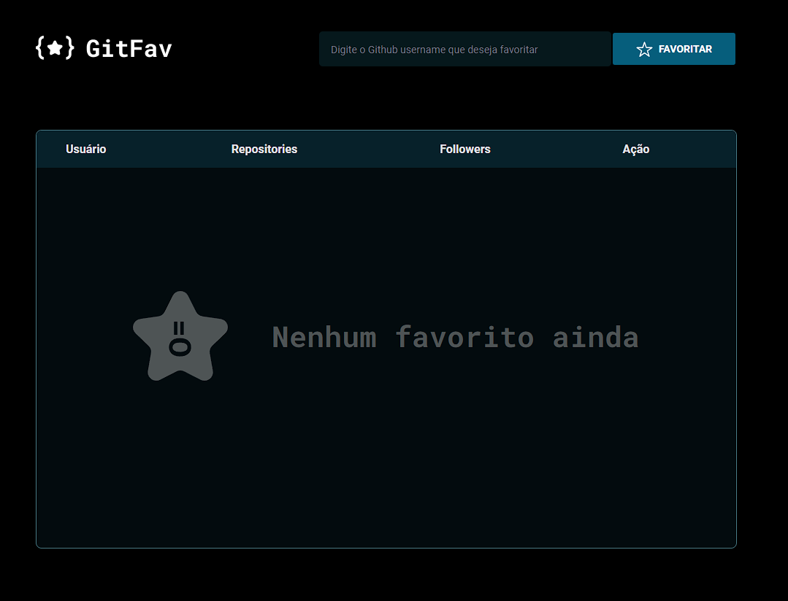

<h1 align="center"> Gitfav </h1>

Gitfav é um projeto exclusivo e promovido pela Rocketseat para ensino de tecnologias WEB.

  <a href="#-tecnologias">Tecnologias</a>&nbsp;&nbsp;&nbsp;|&nbsp;&nbsp;&nbsp;
  <a href="#-projeto">Projeto</a>&nbsp;&nbsp;&nbsp;|&nbsp;&nbsp;&nbsp;
  <a href="#-layout">Layout</a>&nbsp;&nbsp;&nbsp;|&nbsp;&nbsp;&nbsp;
  <a href="#-aprendizado">Aprendizado</a>&nbsp;&nbsp;&nbsp;|&nbsp;&nbsp;&nbsp;
  <a href="#memo-licença">Licença</a>

  

 

  

## 🚀 Tecnologias

Esse projeto foi desenvolvido com as seguintes tecnologias:

- HTML e CSS
- JavaScript
- Git e GitHub

## 💻 Projeto

GitFav é um projeto com objetivo de favoritar usuários do Github.

- [Visite o projeto online](nizsz.github.io/github-favorites/)

## 🔖 Layout

Você pode visualizar o layout do projeto através [DESSE LINK](https://www.figma.com/file/SzQA07HwmSPj4hOYgu1Pps/%5BDesafios-Explorer%5D-GitFav-(Copy)/duplicate?node-id=104%3A48). É necessário ter conta no [Figma](https://figma.com) para acessá-lo.  

## 🧠 Aprendizado

Nesse projeto eu aprendi;

- Class e suas funcionalidades.
- Herança de Class.
- Promise.
- Async e Await e sua funcionalidade.
- Try, Catch e Throw.

## :memo: Licença

Esse projeto está sob a licença MIT.

---